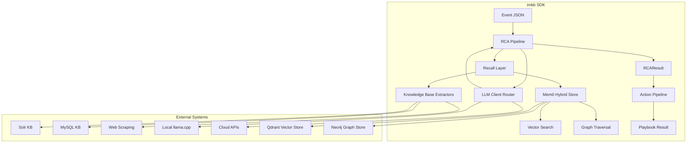

# imkb Library · Detailed Design Document

## Project Overview

**imkb** is a standalone Python SDK designed for operations scenarios to transform "incident/alert events" into **AI-inferrable context** and help local or remote Large Language Models (LLMs) generate **Root Cause Analysis (RCA)** and **remediation suggestions**.

### Core Positioning
- Focus on *knowledge retrieval* and *inference orchestration*
- Independent of any specific alerting platform or execution framework
- Directly callable by various upper-layer applications such as CLI tools, bots, web services, etc.

## Design Objectives

| ID | Objective | Quantitative Metrics |
|---|----------|----------------------|
|G1|Provide unified **Event→RCA** and **RCA→Action** APIs|`get_rca()` P95 < 800ms|
|G2|Support **multi-knowledge-base/multi-LLM/multi-storage-backend** plug-and-play|Adding new Extractor/LLM without core changes|
|G3|Built-in **recall + graph association + token reduction** strategies|Recall@10 ≥ 0.9; Prompt Token↓ 60%|
|G4|Production observability: OpenTelemetry Trace, Prometheus metrics|Four key spans (`recall/kb_query/llm_infer/save`)|

## Core Concepts

| Concept | Description |
|---------|-------------|
|**Extractor**|Retrieval plugin for a single knowledge source (RHOKP, MySQLKB, etc.)|
|**Recall**|Retrieve candidate snippets from memory layer through Mem0's vector+graph hybrid algorithm|
|**LLM Client**|Encapsulates local/remote LLMs (DeepSeek, Llama.cpp, OpenAI, etc.)|
|**RCA Pipeline**|High-level flow: Event → Recall → LLM → `RCAResult`|
|**Action Pipeline**|Root cause → Historical playbook recall → New remediation script|
|**Adapter**|Interface to external backends like Mem0, Qdrant, Neo4j, Solr, Playwright|
|**Namespace**|`<env>-<org_id>` database isolation|

## System Architecture



## Latency Budget Allocation

| Layer | Key Operation | Target P95 | Solution Points |
|-------|---------------|------------|-----------------|
|Mem0 Vector Recall|vector.search + Top-K filtering|≤ 120ms|HNSW + quantization; batch queries; cache recent 1min hits|
|Graph Association (Neo4j)|MATCH … 1–2 hops|≤ 80ms|Pre-built indexes; limit to max two hops; same-direction traversal|
|KB External Call (Solr)|JSON API|≤ 150ms|Only call on vector miss; write results to Mem0, no re-call within 1h if hit|
|Playwright Scraping|Browser scraping|≤ 300ms|Only as last resort; degrade when circuit breaker threshold reached|
|Prompt Generation & LLM Inference|Jinja2 rendering + LLM call|Local LLM ≤ 300ms<br/>Cloud API ≤ 500ms|KV-cache reuse; Token ≤ 1k; concurrent token bucket|
|Others (serialization, tracing)|JSON encode / OTLP span|≤ 50ms|uvloop / orjson|

**Budget Summary**:
- Cache hit path: ≈ 470ms
- Cold path (with Solr): ≈ 700ms  
- Extreme cold path (Playwright): ≈ 950ms → Trigger degradation

## Package Structure Design

```
imkb/
├── __init__.py               # Export top-level APIs
├── adapters/                 # Third-party backend adapter layer
│   ├── __init__.py
│   ├── mem0.py              # Mem0 SDK wrapper
│   ├── qdrant.py
│   ├── neo4j.py
│   ├── solr.py
│   └── playwright.py
├── extractors/              # Knowledge source plugin directory
│   ├── __init__.py          # Registry
│   ├── base.py              # BaseExtractor Protocol
│   ├── rhokp.py             # Red Hat knowledge base
│   ├── mysqlkb.py           # MySQL failure database
│   └── postgreskb.py        # PostgreSQL knowledge base
├── prompts/                 # Jinja2 templates & metadata
│   ├── mysql_rca/
│   │   ├── v1/
│   │   │   ├── template.jinja2
│   │   │   └── meta.yaml
│   │   └── v2/
│   └── postgres_rca/
├── llm_client.py            # Async Router to local/remote LLM
├── recall.py                # Core recall strategy (Mem0 hybrid)
├── rca_pipeline.py          # High-level API: get_rca()
├── action_pipeline.py       # High-level API: gen_playbook()
├── context.py               # Namespace context management
├── config.py                # pydantic Settings
├── models.py                # Core data models
├── telemetry.py             # OpenTelemetry & metrics
└── cli.py                   # `python -m imkb ...`
```

## Core Data Models

### Event Schema

```python
class Event(TypedDict):
    id: str                  # UUID
    signature: str           # hash-or-error_code, used for deduplication & vectorization
    context_hash: str        # sha256(labels+message first 64 chars)
    timestamp: str           # ISO8601
    severity: Literal["P0", "P1", "P2", "P3"]
    source: str              # "prometheus", "alertmanager", etc.
    labels: dict[str, str]   # {"cluster": "prod-eu1", ...}
    message: str             # Limited to 256 chars
    raw: dict                # Original alert full text
    embedding_version: str   # "v1.0" supports vector model upgrades
```

### Knowledge Base Item

```python
class KBItem(TypedDict):
    doc_id: str
    excerpt: str             # Document snippet
    score: float             # 0.0-1.0 similarity score
    metadata: dict           # Source, timestamp, and other metadata
```

### RCA Result

```python
class RCAResult(BaseModel):
    root_cause: str          # Root cause analysis text
    confidence: float = Field(ge=0.0, le=1.0)  # 0.0-1.0 confidence level
    extractor: str           # Name of extractor used
    references: list[KBItem] = Field(default_factory=list) # Referenced knowledge snippets
    status: str = "SUCCESS"  # SUCCESS|PARSE_ERROR|NO_CONTEXT|LLM_ERROR
    contributing_factors: list[str] = Field(default_factory=list)     # Contributing factors
    evidence: list[str] = Field(default_factory=list)                 # Evidence chain
    immediate_actions: list[str] = Field(default_factory=list)        # Immediate actions
    preventive_measures: list[str] = Field(default_factory=list)      # Preventive measures
    additional_investigation: list[str] = Field(default_factory=list) # Additional investigation points
    confidence_reasoning: str = ""           # Confidence reasoning
    knowledge_gaps: list[str] = Field(default_factory=list)           # Knowledge gaps
    metadata: dict[str, Any] = Field(default_factory=dict)            # Metadata
```

## Extractor Architecture

### BaseExtractor Protocol

```python
class BaseExtractor(Protocol):
    name: str
    prompt_template: str     # Template path pointing to prompts/ directory
    
    async def match(self, event: Event) -> bool:
        """Determine if plugin is applicable (based on labels/keywords/resource type)"""
        ...
    
    async def recall(self, event: Event, k: int = 10) -> list[KBItem]:
        """Only responsible for retrieving data snippets (Mem0+KB), no LLM involvement"""
        ...
    
    def get_prompt_context(self, event: Event, snippets: list[KBItem]) -> dict:
        """Customized prompt context construction"""
        ...
```

### Plugin Example: MySQL KB Extractor

```python
class MySQLKBExtractor:
    name = "mysqlkb"
    prompt_template = "mysql_rca:v1"
    
    async def match(self, event: Event) -> bool:
        return "mysql" in event["labels"].get("service", "").lower()
    
    async def recall(self, event: Event, k: int = 10) -> list[KBItem]:
        # 1. Mem0 vector+graph hybrid recall
        mem0_results = await self.mem0_client.search(
            query=event["signature"],
            user_id=f"{namespace}-mysql"
        )
        
        # 2. If insufficient results, query external MySQL KB
        if len(mem0_results) < 3:
            sql_results = await self.query_mysql_kb(event)
            # Write back to Mem0
            await self.mem0_client.add_batch(sql_results)
            
        return self.convert_to_kbitems(mem0_results[:k])
```

## Recall Fusion Strategy

### Mem0 Hybrid Recall Process

1. **Vector First**: `qdrant.search(signature)` Top-K=8
2. **Graph Completion**: For highest-scoring fact, get `(fact)-[:CAUSES]->(insight)` 1-hop
3. **Snippet Denoising**: Dynamic threshold filtering
   - If Top-3 average score > 0.8, threshold = 0.75
   - Otherwise lower to 0.6, ensuring minimum 3 snippets
4. **Insufficient Supplementation**: < 3 snippets → KB external call
5. **Write-back Update**: KB snippets enter vector database and create graph edges `(fact)-[:EVIDENCE]->(kb)`

## Multi-Tenant Isolation

### Security Isolation Scheme

| Layer | Isolation Key | Implementation |
|-------|---------------|----------------|
|Configuration|`namespace = f"{env}-{org_id}"`|Use ContextVar + NamespaceContext manager, pass through entire chain|
|Mem0-Qdrant|`collection = "vec_" + namespace`|Independent collection per tenant|
|Mem0-Graph (Neo4j)|Use database-level isolation|Independent database per tenant, avoid Cypher injection|
|Solr/SQL KB|core/schema per-tenant prefix|Adapter appends tenant identifier when querying|
|LLM Router|Route rules mapped by tenant|YAML: `llm.routers.<namespace>.provider`|

### Query Auditing

All cross-tenant access attempts are logged to audit logs, including:
- Access time, user ID, target namespace
- Query content hash
- Success status and failure reasons

## Configuration System

### Main Configuration File (imkb.yml)

```yaml
llm:
  default: "openai_dev"
  routers:
    openai_dev:
      provider: "openai"
      model: "gpt-4o-mini"
      api_key: "sk-placeholder-key-for-development"
      temperature: 0.2
      max_tokens: 2048
    # Local inference services (OpenAI-compatible APIs)
    ollama_local:
      provider: "local"
      model: "llama3.1:8b"
      base_url: "http://localhost:11434/v1"
      api_key: "not-needed"
      temperature: 0.2
      max_tokens: 2048
    lmstudio_local:
      provider: "local"
      model: "llama-3.1-8b-instruct"
      base_url: "http://localhost:1234/v1"
      api_key: "lm-studio"
      temperature: 0.2
      max_tokens: 2048

mem0:
  vector_store:
    provider: "qdrant"
    host: "localhost"
    port: 6333
    embedding_model_dims: 1536
  graph_store:
    provider: "neo4j"
    url: "neo4j://localhost:7687"
    username: "neo4j"
    password: "${NEO4J_PASSWORD}"

extractors:
  enabled:
    - test
    - mysqlkb
  priority_order:
    - mysqlkb  # Priority order
    - test
  test:
    timeout: 5.0
    max_results: 8
    enabled: true
  mysqlkb:
    timeout: 3.0
    max_results: 10
    enabled: true

prompts:
  rca_template_path: "test_rca/v1/template.jinja2"
  action_template_path: "action_generation/v1/template.jinja2"
  prompts_dir: "src/imkb/prompts"

features:
  mem0_graph: true
  solr_kb: true
  playwright_kb: false
  local_llm: true
  cloud_llm: true

telemetry:
  otlp_endpoint: "http://localhost:4317"
  enable_metrics: true
  enable_tracing: true
```

## Error Handling & Degradation Strategies

| Failure Type | Handling Strategy | Impact |
|--------------|-------------------|---------|
|LLM timeout/5xx|Return `confidence=0` + `status="LLM_UNAVAILABLE"`|Maintain chain archive|
|Mem0 write failure|Retry 3 times → fallback to Redis buffer; async write-back|Don't block RCA output|
|KB external call 429|Trigger `kb_status=degraded`, 30s silence; rely only on vector recall|Stable P95 latency|
|Completely empty recall|Return `status="NO_CONTEXT"`|On-call personnel intervention|
|Latency exceeds threshold|Circuit breaker, skip non-core steps|Ensure basic availability|

## Prompt Management & Versioning

### Template Structure

```
prompts/mysql_rca/v1/
├── template.jinja2
└── meta.yaml
```

**template.jinja2**:
```jinja2
You are an expert MySQL DBA analyzing a production incident.

## Event Details
- ID: {{ event.id }}
- Severity: {{ event.severity }}
- Message: {{ event.message }}
- Labels: {{ event.labels | tojson }}

## Relevant Knowledge

- **{{ snippet.doc_id }}** (score: {{ snippet.score }}): {{ snippet.excerpt }}


## Task
Provide root cause analysis in JSON format:
{
  "root_cause": "detailed explanation",
  "confidence": 0.85,
  "next_steps": ["step1", "step2"]
}
```

**meta.yaml**:
```yaml
version: "v1"
min_llm_context_window: 4096
inputs:
  - event
  - snippets
output_schema: "RCAResult"
description: "MySQL incident root cause analysis"
```

### Version Upgrade Mechanism

```python
# Hot switch to new version
await prompt_manager.upgrade("mysql_rca", "v2")

# Rollback to previous version
await prompt_manager.rollback("mysql_rca")
```

## MVP Implementation Plan

### Phase 1: Core Recall + Inference
- [x] Mem0 vector+graph hybrid recall
- [x] Unified LLM client (local/cloud)
- [x] MySQL KB Extractor
- [x] Basic error handling

### Phase 2: Production Ready
- [x] Multi-tenant isolation (ContextVar + NamespaceContext)
- [x] OpenTelemetry observability
- [x] Multi-LLM routing (OpenAI, Local services, Mock)
- [x] Action Pipeline

### Phase 3: Extensions
- [x] Local LLM service support (Ollama, LMStudio, vLLM)
- [x] Configuration system improvements
- [ ] More Extractor plugins
- [ ] Web UI
- [ ] Performance optimization

## Dependency Management

### pyproject.toml Configuration

```toml
[project.optional-dependencies]
mem0 = ["mem0-ai>=1.0", "qdrant-client>=1.7"]
graph = ["neo4j>=5.0"]
kb = ["solr>=2.0", "playwright>=1.40"]
llm-gpu = ["llama-cpp-python", "torch"]
all = ["imkb[mem0,graph,kb,llm-gpu]"]
```

### Installation Examples

```bash
# MVP minimal installation
pip install imkb[mem0,graph]

# Full features
pip install imkb[all]
```

## Observability

### OpenTelemetry Spans

- `imkb.get_rca` (root span)
  - `recall.mem0_search`
  - `recall.kb_query` 
  - `llm.infer`
  - `mem0.save_results`

### Prometheus Metrics

- `imkb_rca_duration_seconds`
- `imkb_recall_hit_rate`
- `imkb_llm_token_usage`
- `imkb_error_count_total`

## Summary

imkb is designed as a high-performance, scalable AI operations knowledge retrieval and inference SDK. Through Mem0's vector+graph hybrid architecture, it achieves efficient knowledge recall and relationship reasoning. The modular Extractor system supports seamless integration of multiple knowledge sources, while the unified LLM client provides flexible model selection.

The design focuses on production environment performance requirements (P95 < 800ms), multi-tenant security isolation, and comprehensive observability support, providing a solid technical foundation for enterprise-level operations AI applications.